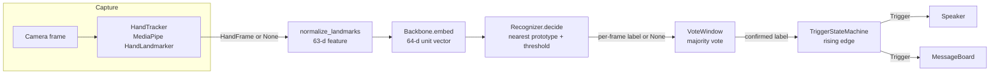
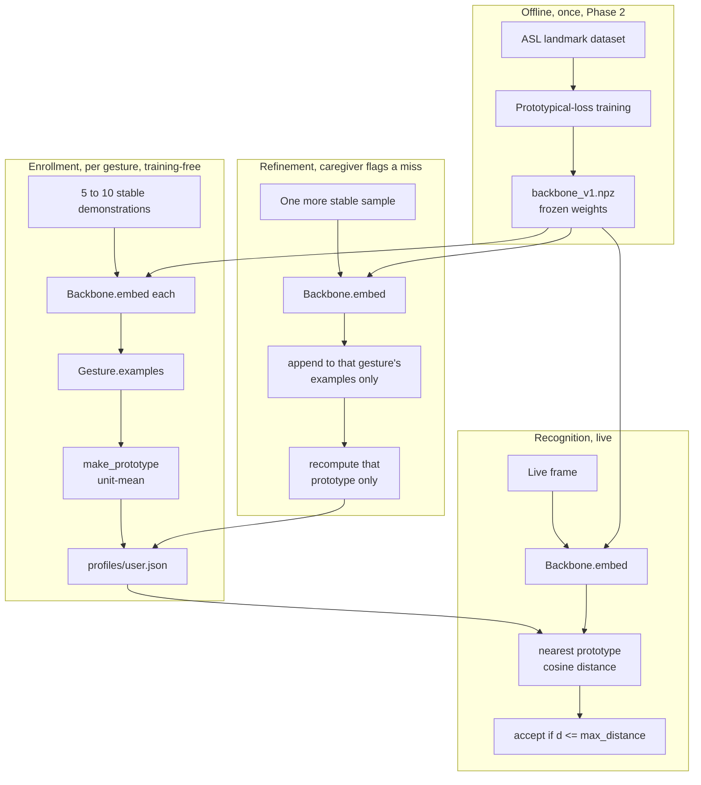

# Architecture

One frozen embedding space, built once offline from ASL landmarks (Phase 2), and two things a
caregiver does with it at runtime: enroll a personal gesture from a few examples, and have the
system recognize it live. Neither path ever updates the embedding network's weights.

## Pipeline

`Pipeline.process` runs the whole left-to-right chain on a live camera frame;
`Pipeline.process_hand_frame` starts from an already-tracked `HandFrame` (or `None`), which is
how session replay and every evaluation script in Phase 5 exercise the same code path offline.

## Enrollment vs. recognition data flow

The backbone is shared and frozen across both paths. Enrollment and refinement only ever append
to, or recompute the prototype of, the one gesture being taught; every other gesture's examples
and prototype are untouched (`pgvb.enroll.Refiner`, verified by `tests/test_stability.py` and,
per participant, by `scripts/eval_stability.py`), which is what O4 requires.

## Module map

See `docs/PLAN.md` Section 3 for the full repository layout. In short: `pgvb/landmarks.py` and
`pgvb/features.py` are the capture-to-feature stage; `pgvb/embedding.py` wraps the frozen
backbone; `pgvb/profile.py` and `pgvb/prototypes.py` hold the per-user gesture store;
`pgvb/enroll.py`, `pgvb/recognize.py`, `pgvb/smoothing.py`, and `pgvb/output.py` implement
enrollment, recognition, smoothing, and speech; `pgvb/pipeline.py` wires all of it together;
`pgvb/gui/` is the Tkinter front end built in Phase 4.
