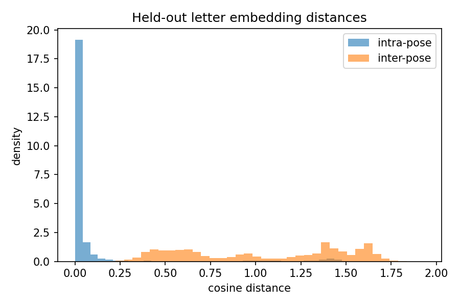

# Backbone v1 held-out evaluation

Held-out letters (never seen during training): B, C, L, V, Y.
Support from signer A (`asl_train`), query from signer B (`asl_test`), 500 episodes.

| Metric | Value | Target |
|---|---|---|
| 5-way 5-shot accuracy | 0.988 | >= 0.85 (target 0.90) |
| 5-way 1-shot accuracy | 0.957 | >= 0.70 |
| Mean intra-pose cosine distance | 0.0960 | lower than inter-pose |
| 95th percentile intra-pose distance | 0.9570 | |
| Mean inter-pose cosine distance | 1.0405 | higher than intra-pose |

